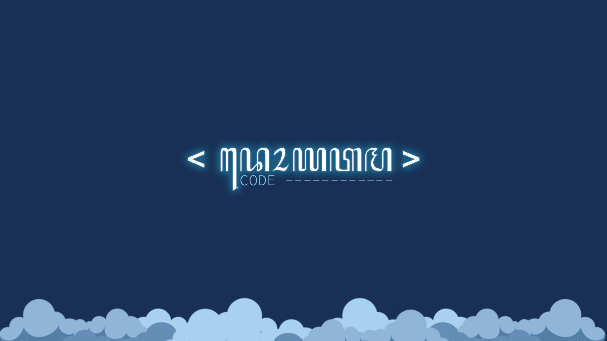

# Welcome to Doyatama Code

## About Doyatama Code


Perkenalkan Saya Dito Cahya Pratama, saya adalah instruktur anda. Sehingga anda bisa menjadi programmer profesional.

## Getting Started



Adapun bahan - bahan yang dibutuhkan supaya melancarkan pelatihan anda:

```
Visual Studio Code - https://code.visualstudio.com/
Telegram Desktop   - https://desktop.telegram.org/
Node JS            - https://nodejs.org/en/
Chrome             - https://www.google.com/chrome/?brand=CHBD&gclid=Cj0KCQjwoaz3BRDnARIsAF1RfLdnIVg2JlQmRVi_kLd_7uWlfoSz9uNvcIOZ32Msk0vzWJUSIqaLNGkaAopqEALw_wcB&gclsrc=aw.ds
Git                - https://git-scm.com/downloads
```


 Perhatian jika anda sudah memiliki program diatas anda bisa melewatinya ke next step  :\)



