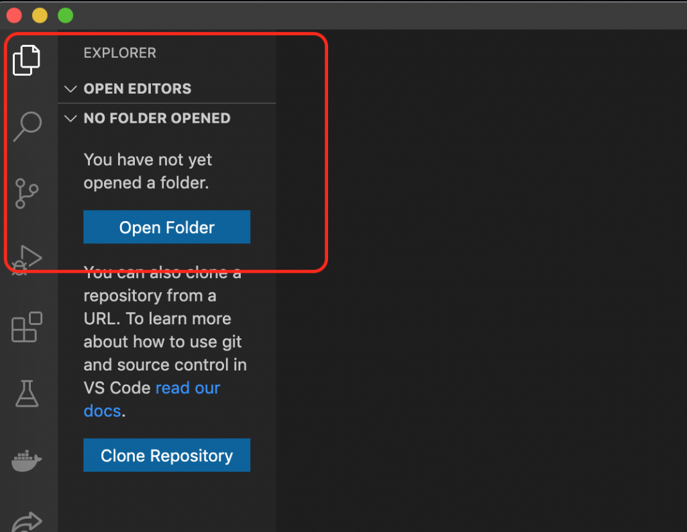

# JavaScript Dasar untuk React – Variable, Object & Scope

## Apa itu Javascript ?

Bagi yang masih awam, tentu akan bertanya-tanya, _apa itu JavaScript_? **JavaScript** adalah salah satu bahasa pemrograman yang paling banyak digunakan dalam kurun waktu dua puluh tahun ini. Bahkan JavaScript juga dikenal sebagai salah satu dari tiga bahasa pemrograman utama bagi web developer:

1. HTML: Memungkinkan Anda untuk menambahkan konten ke halaman web.
2. CSS: Menentukan layout, style, serta keselarasan halaman website.
3. JavaScript: Menyempurnakan tampilan dan sistem halaman web.

JavaScript dapat [dipelajari](https://www.bitdegree.org/learn/javascript-basics/) dengan cepat dan mudah serta digunakan untuk berbagai tujuan, mulai dari meningkatkan fungsionalitas website hingga mengaktifkan permainan \(_games_\) dan software berbasis web. Selain itu, terdapat ribuan template dan aplikasi JavaScript yang bisa Anda gunakan secara gratis dan semuanya ini berkat beberapa situs, seperti Github.

Pada kali ini kita akan mempelajari mengenai:

* Variable
* Object
* Scope

Oke langsung saja tidak usah berbicara panjang lebar lagi, teman-teman dapat langsung mengkses materi di link video berikut ini :

source code pada video tersebut dapat teman-teman akses di link github berikut ini : 

Untuk membuka source code tersebut di Visual Studio Code, teman-teman pastikan sudah menginstall Visual Studio Code terlebih dahulu lalu membuka programnya.

Setelah itu klik Open Folder seperti pada gambar di bawah ini

Lalu terlebih dahulu extract file zip yang teman-teman download dari link github, dan pilih folder hasil dari extract tersebut, seperti pada gambar di bawah ini

Maka akhirnya teman-teman akan mendapatkan hasil seperti ini

Lalu, teman-teman bisa mengedit sesukanya di file index.js, dan juga dapat melihat console dengan buka file index.html dengan browser chrome dan buka Developer Tools, caranya sudah disampaikan pada video.

Oke, materi pada kali ini cukup sampai disini, ingat, ini hanya secuil ilmu saja teman-teman, alangkah lebih baik teman-teman explore lebih dalam lagi dengan membaca-baca artikel dan lain sebagainya untuk menambah ilmu teman-teman. Good luck !!

Referensi:

* \[Basic JavaScript\] [https://javascript.info/first-steps](https://javascript.info/first-steps)
* \[Grammar & Types di JavaScript\] [https://developer.mozilla.org/en-US/docs/Web/JavaScript/Guide/Grammar\_and\_Types](https://developer.mozilla.org/en-US/docs/Web/JavaScript/Guide/Grammar_and_Types)
* \[JavaScript Bahasa Paling Populer\] [https://insights.stackoverflow.com/survey/2020\#most-popular-technologies](https://insights.stackoverflow.com/survey/2020#most-popular-technologies)
* \[JavaScript vs Python, mana lebih populer?\] [https://morioh.com/p/3eb8f8179df2](https://morioh.com/p/3eb8f8179df2)

